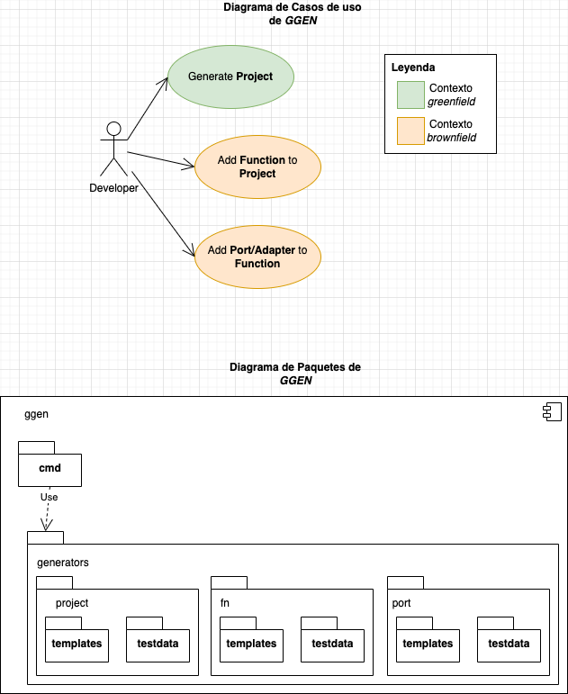
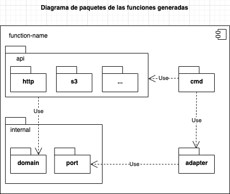

# GGEN
PoC herramienta de línea de comandos, escrita en Go para hacer _scaffolding_ de funciones lambdas.

## Introducción

En esta poc se muestra como realizar un cliente de linea de comandos escrito en Go que permita la generación de código _boilerplate_ usando plantillas y la biblioteca Jennifer.

## Objetivo de diseño

*Requerido:*

- El generador debe permitir la generación de funciones lambda en Go usando una arquitectura hexagonal.
- Se debe poder:
  - configurar:
  - nombre
  - tipo de evento que dispara la función (_apigwproxy_, etc)
    - agregar puertos
    - agregar adaptadores:
      - repositorio a tabla dynamodb
        - clientes API REST
        - proxy a servicios web SOAP
        - etc.

*Nota:* Para el alcance de esta PoC, solo se implementa el evento del _apigwproxy_ y el adaptador dynamodb.

*Atributos de calidad:*

1. Portable: debe poder instalarse fácilmente en diversos sistemas operativos sin llevar consigo dependencias de otras herramientas.
2. Mantenible: las plantillas base o el código _boilerplate_ debe poder ser actualizado fácilmente sin necesidad de reinstalar el cli.
3. Extensible: debe ser fácil agregar nuevas plantillas.

*Deseable:*
Debe ser fácilmente adaptable a distintos canales (cli, ide, web, chatbot, etc).

*Nota:*
Con el fin de mantener la facilidad solo se consideran casos de uso tipo _Greenfield_ en donde se necesita crear la estructura base desde cero.

Ejemplo de uso desde la terminal:
*Nota:* Esto es una visión de cómo sería la interfaz de linea de comandos.

Para iniciar un proyecto basado en funciones

```sh
ggen init <PROJECT_NAME>
[INFO] Generando desde la plantilla...
[INFO] proyecto base generado ✅
```

Para agregar una función, debe hacerse sobre un proyecto iniciado.

```sh
ggen add fn
> ¿Cuál es el nombre de la función? (my-function)
> ¿Qué tipo de evento disparará la función?
 👉 - API Proxy HTTP
    - S3
    - EventBridge

[INFO] Generando desde la plantilla...
[INFO] Función generada ✅
```

Para agregar un puerto y adaptador a una función:

```sh
ggen add port -f my-function
> ¿Cuál es el nombre del puerto?
> ¿Agregar adaptador? (Y/n)
> Tipo de adaptador
    - Genérico
 👉 - Repositorio tabla DynamoDB
    - Repositorio Documento DocumentDB
    - Cliente API REST
    - Proxy WS SOAP

[INFO] Generando desde la plantilla...
[INFO] Puerto y Adaptador generado ✅
```

Para generar un servicio:

```sh
ggen add svc -f my-function
> Tipo de servicio
    - Dominio
 👉 - Aplicación
 > Nombre del servicio (my-service)

[INFO] Generando desde la plantilla...
[INFO] Servicio generado ✅
```

## Diseño a alto nivel

En la siguiente imagen se muestra el diseño a alto nivel de la solución propuesta:



- Para la creación del cliente en linea de comandos se usa [Cobra](https://github.com/spf13/cobra).
- Para la consulta interactiva se usa [PromptUI](https://github.com/manifoldco/promptui).

### Arquitectura función lambda prototipo



> Para saber más puede revisar el proyecto [prototipo](../prototype)

## Decisiones tomadas de antemano

El objetivo es crear un prototipo dogmático con algunas decisiones predefinidas.

Para registros de auditoría (logs):

- [Zap](https://github.com/uber-go/zap)

gestión de trazas:

- [Jaeger](https://github.com/open-telemetry/opentelemetry-go)

Validación de entrada:

- [Validator](https://github.com/go-playground/validator)

Resiliencia

- [Histryx-go](https://github.com/afex/hystrix-go)

Para pruebas:

- [Testify](https://github.com/stretchr/testify)

Para el consumo de servicios de AWS se utilizan las bibliotecas proporcionadas por AWS.

## Recomendaciones para agregar Puertos y Adaptadores

En este tutorial se explica cómo agregar un `adapter` basado en S3 para el puerto de tipo _storage_.

Para la creación de `adapters`, recomendamos encarecidamente:

- Entender la arquitectura propuesta para las funciones, la cuál está basada en una arquitectura Hexagonal.

- Primero intente descargar y probar los adaptadores existentes en el proyecto *prototipo*. Si tiene alguna duda, puede preguntar a alguno de las personas que mantienen el repositorio, con gusto le ayudaran.

Los adaptadores siempre esta relacionados con un puerto. Los puertos son abstracciones que exponen capacidades usadas internamente por los servicios de dominio. La tarea de los adaptadores es implementar las interfaces definidas por los puertos evitando así que la lógica interna de la función se acople a servicios externos.

De acuerdo a lo anterior, el puerto de tipo _storage_ que encontrará en la ruta `function-name/internal/port` puede tener varias implementaciones en la ruta `function-name/adapter`. Esto es natural ya que el puerto _storage_ representa un almacén de archivos remoto y esta capacidad de almacenamiento la puede ofrecer cualquier proveedor, podría ser incluso un repositorio FTP.

En este caso, encontrará una definición del puerto similar a ésta:

```golang
type MyStoragePort interface {
  PutFile(key string, content []byte) error
  GetFile(key, version string) ([]byte, error)
}
```

Es importante mantener los puertos lo *mas abstractos posible*, tratando de capturar la capacidad que se supone deben exponer.

> Aspectos de configuración, auditoría y monitoreo deben ser llevados a cabo por el adaptador.

Una vez agregado el *Puerto* e implementado el *Adaptador* al proyecto prototipo, puede proceder a convertirlo en una plantilla, para ello le recomendamos los siguiente:

- Identifique que propiedades o aspectos del *Puerto* y/o *Adaptador* pueden ser configurables.

- Agregue un nuevo generador en la carpeta `generators` del proyecto `ggen`. Recuerde que un *Generador* se compone de:
  - `templates/`: contiene funciones de go que expone las plantillas necesarias.
  
  - `testdata/`: contiene funciones de go que exponen las plantillas rellenadas con datos dummy. Esto para la realización de pruebas unitarias del generador.

  - `my_adapter_generator.go`: lógica del generador, normalmente contiene la dependencia al objeto `GeneratorHelperDefault` el cuál expone funciones útiles para la generación de artefactos.

  - `my_adapter_generator_test.go`: pruebas unitarias del Generador del adaptador. Recomendamos usar un enfoque de desarrollo dirigido por pruebas. Puede basarse en los generadores creados para hacerse a una idea de como probarlos.

## Mini-tutorial: Cómo usar el generador en una solución real

En este mini-tutorial se explica cómo construir un bot de slack que sirva para iniciar proyectos serverless basados en AWS lambda usando Golang con `ggen`.

TODO

## Referencias

1. <https://github.com/RanchoCooper/go-hexagonal>
2. <https://blog.ralch.com/articles/golang-code-generation-tool-implementation/>
3. <https://github.com/dave/jennifer>
4. <https://awesomeopensource.com/project/Alikhll/golang-developer-roadmap>
